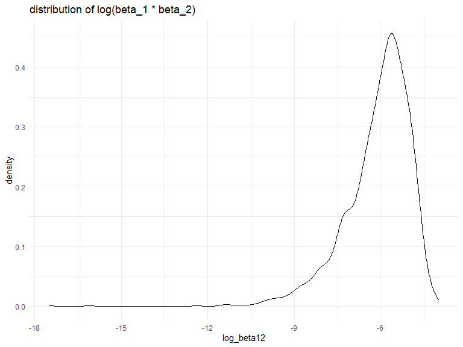
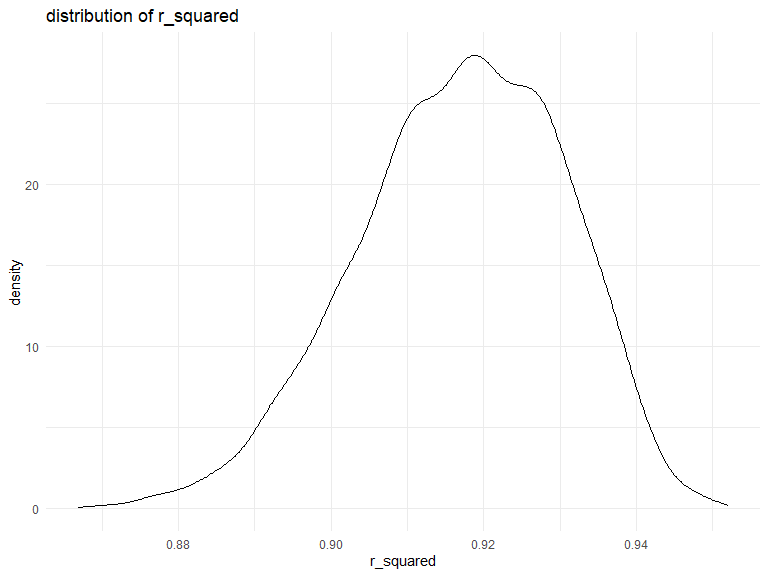
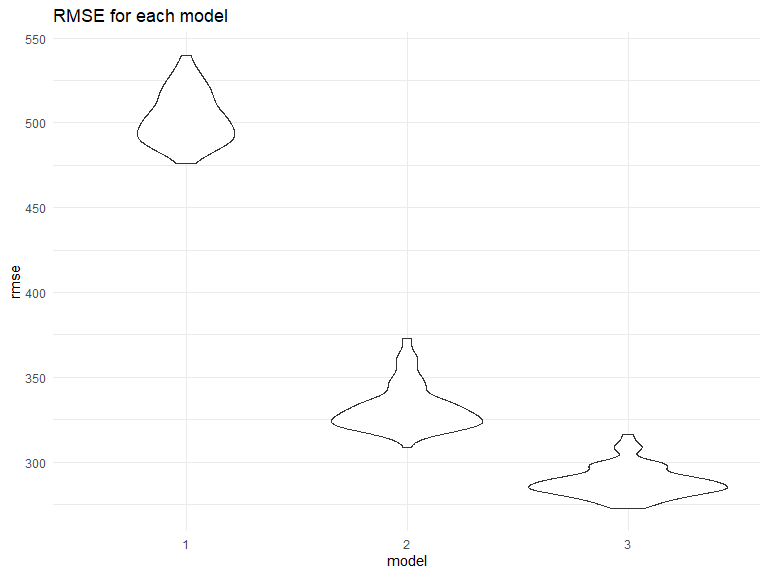

Untitled
================
Xiangxiong Feng
2023-11-30

# Problem 2

## Download dataset

``` r
weather_df = 
  rnoaa::meteo_pull_monitors(
    c("USW00094728"),
    var = c("PRCP", "TMIN", "TMAX"), 
    date_min = "2022-01-01",
    date_max = "2022-12-31") |>
  mutate(
    name = recode(id, USW00094728 = "CentralPark_NY"),
    tmin = tmin / 10,
    tmax = tmax / 10) |>
  select(name, id, everything())
```

    ## using cached file: C:\Users\gdso\AppData\Local/R/cache/R/rnoaa/noaa_ghcnd/USW00094728.dly

    ## date created (size, mb): 2023-10-13 16:03:07.606289 (8.551)

    ## file min/max dates: 1869-01-01 / 2023-10-31

## Bootstrap and linear model

``` r
weather_bootstrap =
  weather_df|>
  modelr::bootstrap(n = 5000)|>
  mutate(
    models = map(strap, \(df) lm(tmax ~ tmin + prcp, data = df)),
    tidy_results = map(models, broom::tidy),
    glance_results = map(models, broom::glance))|>
  select(tidy_results, glance_results, .id)|>
  unnest(tidy_results, glance_results)|>
  select(.id, term, estimate, r.squared)|>
  group_by(.id)|>
  summarize(log_beta12 = log(estimate[2]) + log(estimate[3]),
            r_squared = r.squared)|>
  distinct()
```

    ## `summarise()` has grouped output by '.id'. You can override using the `.groups`
    ## argument.

## Distribution of log(beta_1 \* beta_2)

``` r
weather_bootstrap|>
  ggplot(aes(x=log_beta12))+
  geom_density() + ggtitle('distribution of log(beta_1 * beta_2)')
```



The distribution is skewed to the left. The density is highest when
values are around -5 to -6.

## Distribution of r_squared

``` r
weather_bootstrap|>
  ggplot(aes(x=r_squared))+
  geom_density() + ggtitle('distribution of r_squared ')
```



The distribution is relatively normal but still skewed to the left a
little bit. The density is highest when values are around 0.92.

## 2.5% and 97.5% quantiles and CI

``` r
CI_rsquared_log_beta12 =
  tibble(
    upper_beta12= weather_bootstrap |> pull(log_beta12) |> quantile(0.975, na.rm = TRUE),
    lower_beta12= weather_bootstrap |> pull(log_beta12) |> quantile(0.025, na.rm = TRUE),
    upper_rsquared= weather_bootstrap |> pull(r_squared) |> quantile(0.975, na.rm = TRUE),
    lower_rsquared= weather_bootstrap |> pull(r_squared) |> quantile(0.025, na.rm = TRUE))

CI_rsquared_log_beta12
```

    ## # A tibble: 1 × 4
    ##   upper_beta12 lower_beta12 upper_rsquared lower_rsquared
    ##          <dbl>        <dbl>          <dbl>          <dbl>
    ## 1        -4.61        -8.92          0.940          0.889

2.5% and 97.5% quantiles (confident Interval) of R squared and log(beta
1\*beta 2) are shown above.

# Problem 3

``` r
birth_weight = 
  read.csv('data/birthweight.csv')|>
  janitor::clean_names()|>
  drop_na()|>
  mutate(
    babysex = as.factor(babysex),
    frace = as.factor(frace),
    mrace = as.factor(mrace)
    
  )
```

## model 1 bhead + wtgain +mheigth

``` r
model1 = lm(bwt ~ bhead + wtgain +mheight, data = birth_weight)

model1_summary=
  birth_weight|>
  select(bwt, bhead , wtgain ,mheight) |>
  modelr::add_residuals(model1) |> 
  modelr::add_predictions(model1)

head(model1_summary)
```

    ##    bwt bhead wtgain mheight     resid     pred
    ## 1 3629    34     29      63  409.5397 3219.460
    ## 2 3062    34     28      65 -192.0462 3254.046
    ## 3 3345    36     11      64 -252.3645 3597.365
    ## 4 3062    34     30      64 -182.5609 3244.561
    ## 5 3374    34     26      66  110.4686 3263.531
    ## 6 3374    33     14      66  398.7804 2975.220

## model 2 blength + gaweeks

``` r
model2 = lm(bwt ~ blength + gaweeks, data = birth_weight)

model2_summary=
  birth_weight|>
  select(bwt, blength , gaweeks) |>
  modelr::add_residuals(model2) |> 
  modelr::add_predictions(model2)

head(model2_summary)
```

    ##    bwt blength gaweeks     resid     pred
    ## 1 3629      51    39.9  341.1622 3287.838
    ## 2 3062      48    25.9  538.4835 2523.516
    ## 3 3345      50    39.9  185.7178 3159.282
    ## 4 3062      52    40.0 -357.0982 3419.098
    ## 5 3374      52    41.6  -88.3729 3462.373
    ## 6 3374      52    40.7  -64.0309 3438.031

## model 3 bhead + blength + babysex + bhead*blength + bhead*babysex + blength*babysex + bhead*blength\*babysex

``` r
model3 = lm(bwt ~ bhead + blength + babysex + bhead*blength + bhead*babysex + blength*babysex + bhead*blength*babysex,data = birth_weight)

model3_summary=
  birth_weight|>
  select(bwt, bhead , blength , babysex) |>
  modelr::add_residuals(model3) |> 
  modelr::add_predictions(model3)


head(model3_summary)
```

    ##    bwt bhead blength babysex      resid     pred
    ## 1 3629    34      51       2  334.62431 3294.376
    ## 2 3062    34      48       1   59.16394 3002.836
    ## 3 3345    36      50       2 -157.23983 3502.240
    ## 4 3062    34      52       1 -274.05285 3336.053
    ## 5 3374    34      52       2  -11.76080 3385.761
    ## 6 3374    33      52       1  190.95508 3183.045

## Cross Validation and Comparsion

``` r
cv_df =
  crossv_mc(birth_weight, 100) |>
  mutate(
    train = map(train, as_tibble),
    test = map(test, as_tibble))
```

``` r
cv_df = 
  cv_df |> 
  mutate(
    model1 = map(train, \(df) lm(bwt ~ momage + smoken, data = df)),
    model2 = map(train, \(df) lm(bwt ~ blength + gaweeks, data = df)),
    model3 = map(train, \(df) lm(bwt ~ bhead + blength + babysex + bhead*blength*babysex, data = df))) |> 
  mutate(
    rmse_1 = map2_dbl(model1, test, \(mod, df) rmse(model = mod, data = df)),
    rmse_2 = map2_dbl(model2, test, \(mod, df) rmse(model = mod, data = df)),
    rmse_3 = map2_dbl(model3, test, \(mod, df) rmse(model = mod, data = df)))
```

``` r
cv_df |>
  select(starts_with('rm'))|>
  pivot_longer(
    everything(),
    names_to = "model", 
    values_to = "rmse",
    names_prefix = "rmse_")|>
  mutate(model = fct_inorder(model)) |> 
  ggplot(aes(x = model, y = rmse)) + geom_violin()+ggtitle('RMSE for each model')
```



Based on the plot above, we can see that model 3 is the most optimal
model and model 2 is the second optimal model by comparing rmse.
